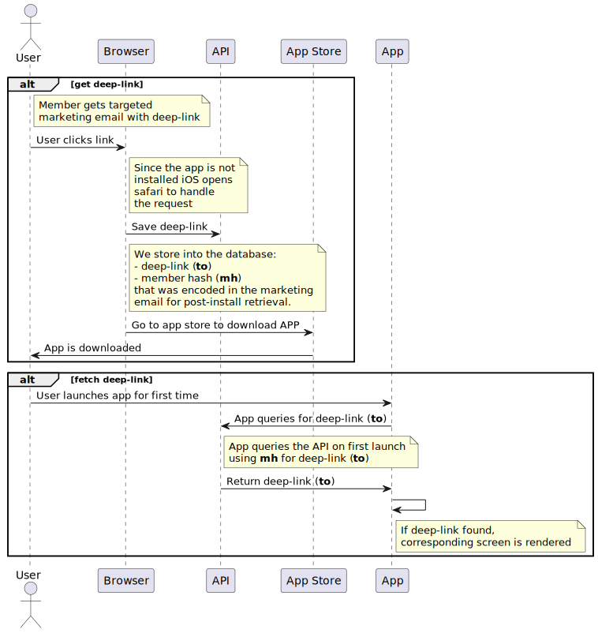
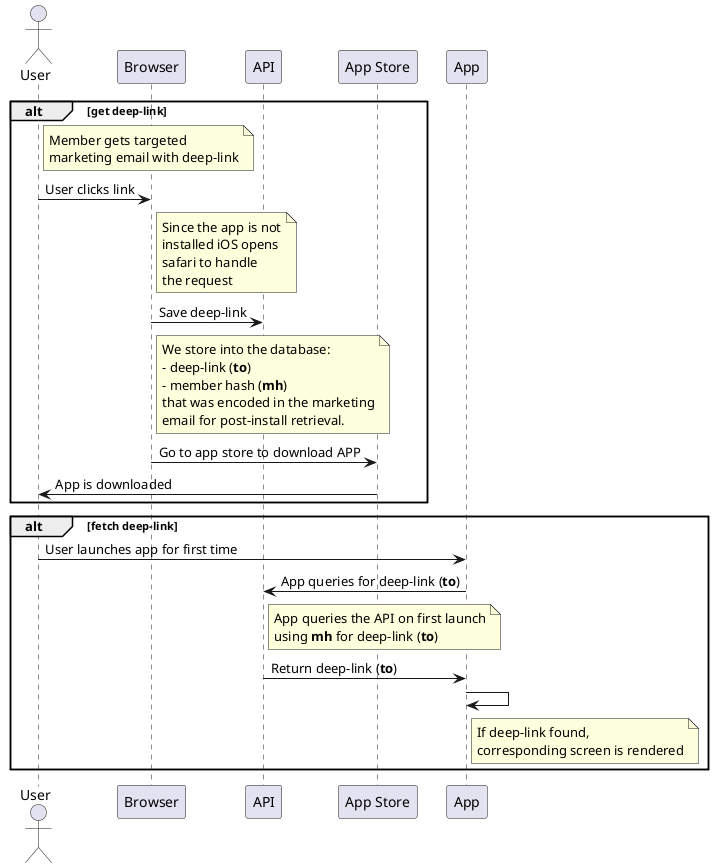
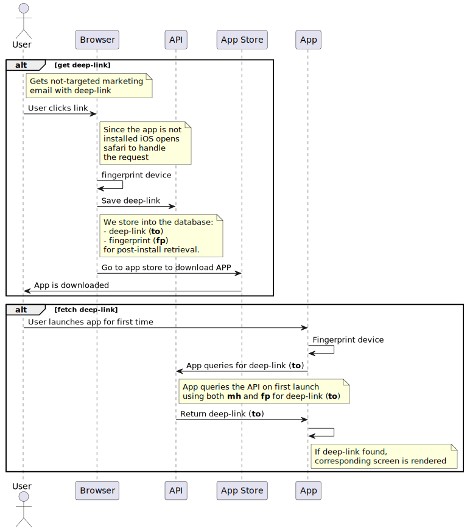
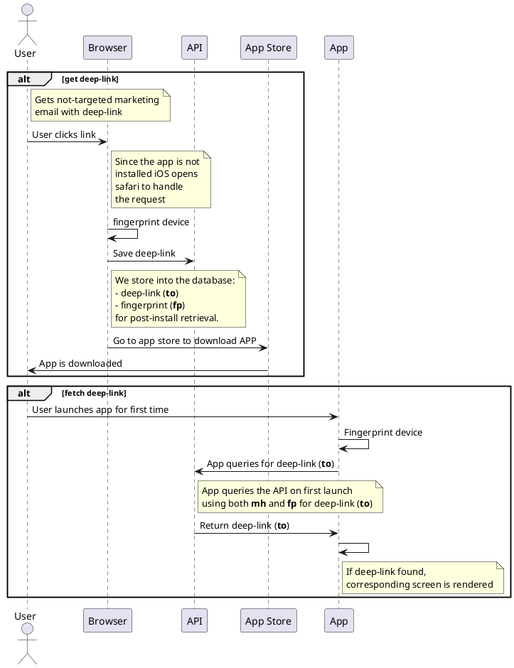

# Deep Link
This repo is the backend implementation of a home-grown POC deep-link solution to allow deep lining into a mobile app from a html link found in an email or elsewhere.

## Problem statement
We need to be able to send deep-links into the app (from various sources like email), that after app installation will deposit the user on the correct screen within the app.

The difficulty is that Apple does not provide an east mechanism to do this if the app has not already been installed.

For users without the app, we need identify the device and capture where within the app they are going and then once the app is installed we need to be able to identify them again to send them to the correct screen.

## Background - what and why
Firebase provides a deep link solution however firebase will be sunsetting the free version of their deep-linking solution. Their and others paid version is cost prohibitive especially for versions that include all "legal agreements" like BAA and DPA. 

Note:
```
This solution only covers iOS. Android is not covered in this POC because google handles this out of the box. 
```


## How it works
There are two variables I am considering in this POC. The first is the `not-targeted` vs `targeted`.

A `not-targeted` email is a mass email with a link into the app without any specific member information.

For example, a marketing email could go out to all members who now have access to a new feature.

note:
```
We could argue that we should make all email not-targeted but this has some issues. More on this under the challanges section.
```

A `targeted` email is one with a link that sends a specific member to a specific screen within the app. In this case the members ID is hashed within the link.

The next variable is whether the app is installed or not. If the app is not installed a whole process must be kicked off.

Below is a table of the various scenarios and the corresponding actions that will be taken are described below.

|               | targeted | not-targeted |
|---------------|----------|--------------|
| app installed | A        | B            |
| not installed | C        | D            |


### More on the `targeted` vs `not-targeted` and the difficulties and a conversation about data security
As mentioned in the problem statement we need to identify the user (before they log-in and even install the app) and then identify them again after they install the app in order to send them to the correct screen. We do this by fingerprinting the device. 

Apple really does not like fingerprint, and they make it very hard. This POC uses a library to accomplish this but the library is not perfect and won't guarantee that the fingerprint will be the same after the app is installed.

With the fingerprint method there exists the possibility that we might cross our marketing wires.

We could choose to make all email as `targeted` emails. This does mean extra work as we would have to encode memberId with the link. This prevents fingerprint collisions but increases data leak risks.


## Scenarios
### A & B: Targeted and not-targeted with **app is installed**
One of the simpler scenarios since the app is already installed.
With `Apple App Site Associating` iOS allows the App to take control over a domain/path which allows deep linking. Having the user's device fingerprinted or the member id at this point is not needed. The app itself can prevent access to un-allowed content.

### C: `Targeted` link with app **not installed**





### D: `Not-targeted` with app **not installed**


